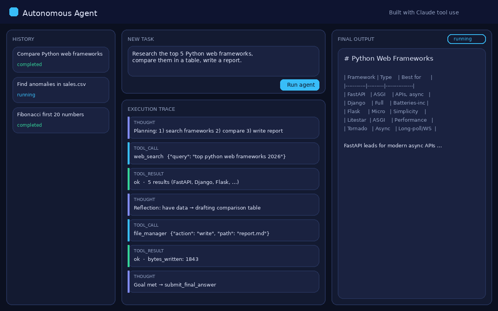
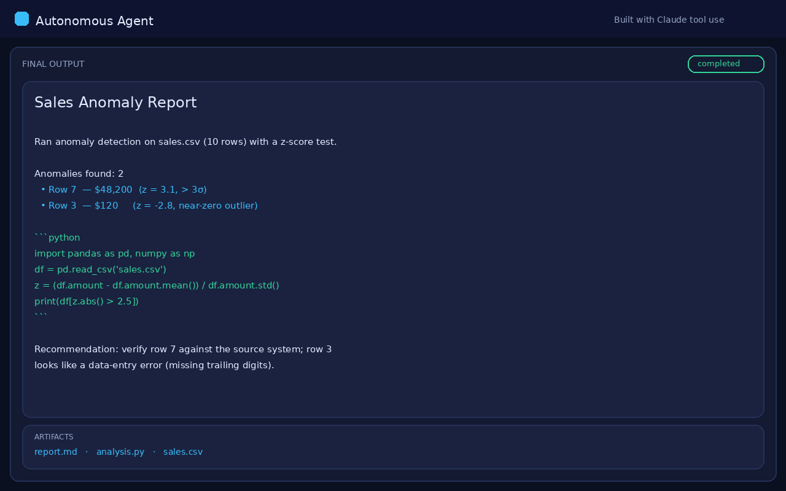
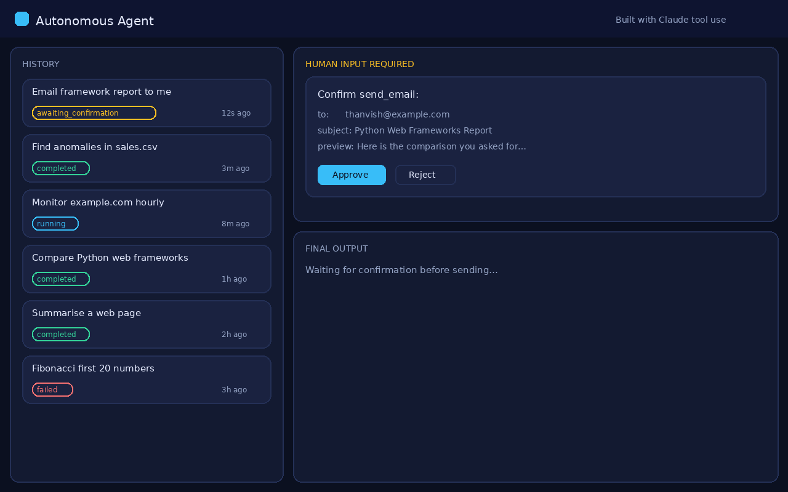

# Autonomous AI Agent

An autonomous task-completion agent powered by **Claude (`claude-sonnet-4-6`) tool use**, orchestrated with **LangGraph**, served over **FastAPI** with **Server-Sent Events**, and driven from a live **React** trace UI.

Give it a goal in plain English. It plans, picks tools, executes, observes results, reflects, retries on failure, and streams every step to your browser in real time.



---

## What it does

```
"Research the top 5 Python web frameworks, compare them, write a report, email it to me"
"Read sales.csv, find anomalies, write a Python analysis script, run it, return results"
"Fetch this URL, summarise it, and list outbound links"
```

The agent decomposes the goal into subtasks, runs the loop below until done, and returns a structured markdown answer.

```
PLAN ─▶ ACT (tool) ─▶ OBSERVE ─▶ REFLECT ─┐
  ▲                                        │
  └──────────── replan / retry ◀───────────┘
                    │
                    ▼
            submit_final_answer
```

---

## Architecture

| Layer | Tech | Responsibility |
|-------|------|----------------|
| **Reasoning** | Claude `claude-sonnet-4-6` + tool use | Plan, choose tools, reflect |
| **Orchestration** | LangGraph state machine | `reason → act → reason` loop with `max_iterations` safeguard |
| **Tools** | Python | `web_search`, `code_executor`, `file_manager`, `http_request`, `send_email`, `recall_memory` |
| **Short-term memory** | In-conversation message log | Working context for the current task |
| **Long-term memory** | ChromaDB vector store | Summaries of past tasks, recalled by similarity |
| **API** | FastAPI + sse-starlette | Task submission, SSE trace stream, HITL confirmation |
| **Queue / state** | Redis (in-memory fallback) | Task persistence + pub/sub |
| **Frontend** | React + Vite + TypeScript | Task input, live trace, markdown output, history |

### Tools

| Tool | Description | Guardrails |
|------|-------------|------------|
| `web_search` | DuckDuckGo top-N results | — |
| `http_request` | GET/POST/… with truncated body | http(s) only |
| `code_executor` | Sandboxed Python subprocess | 30s wall clock, 512MB cap, no network, workspace-scoped, `-I` isolated |
| `file_manager` | read/write/append/list/delete | path-traversal blocked; overwrite/delete need confirmation |
| `send_email` | SMTP send | **always** needs confirmation; dry-runs if SMTP unset |
| `recall_memory` | Semantic search over past tasks | — |

### Human-in-the-loop

Destructive actions (`send_email`, overwriting a non-empty file, deleting) emit a `human_input_required` event and **block** until the user approves/rejects via `POST /tasks/{id}/confirm`. Set `AGENT_AUTO_CONFIRM=true` to bypass for trusted runs.

---

## Quick start (Docker)

```bash
git clone https://github.com/thanvish21/autonomous-ai-agent.git
cd autonomous-ai-agent
cp .env.example .env          # add your ANTHROPIC_API_KEY
docker compose up --build
```

- UI: http://localhost:5173
- API: http://localhost:8000 (docs at `/docs`)

## Quick start (local dev, no Docker)

```bash
cp .env.example .env          # add ANTHROPIC_API_KEY
./scripts/dev.sh              # venv + npm install + redis + both servers
```

Backend on `:8000`, Vite dev server on `:5173` (proxies `/api` → backend).

---

## API

| Method | Route | Purpose |
|--------|-------|---------|
| `POST` | `/tasks` | Submit a task → `{ task_id, stream_url }` |
| `GET` | `/tasks/{id}/stream` | **SSE** stream of reasoning, tool calls, results |
| `GET` | `/tasks/{id}/result` | Final answer + artifacts |
| `GET` | `/tasks/{id}` | Task metadata + state |
| `GET` | `/tasks` | Recent task history |
| `POST` | `/tasks/{id}/confirm` | Approve/reject a pending destructive action |
| `GET` | `/tools` | List available tools |
| `GET` | `/healthz` | Liveness + config flags |

### Example

```bash
# Submit
TASK=$(curl -s localhost:8000/tasks -H 'content-type: application/json' \
  -d '{"prompt":"Compute the first 20 Fibonacci numbers in Python, run it, show output."}' \
  | python3 -c 'import sys,json;print(json.load(sys.stdin)["task_id"])')

# Stream the trace
curl -N localhost:8000/tasks/$TASK/stream

# Fetch final result
curl localhost:8000/tasks/$TASK/result
```

---

## Event stream

Each SSE event is `{ kind, payload, ts }`:

| kind | meaning |
|------|---------|
| `task_started` | goal accepted, prior memory recalled |
| `iteration` | loop counter `n/max` |
| `thought` | agent's reasoning text |
| `tool_call` | tool name + arguments |
| `tool_result` | ok/error + data |
| `human_input_required` | awaiting confirmation |
| `task_completed` / `task_failed` | terminal |





---

## Configuration

All via `.env` (see `.env.example`):

| Var | Default | Notes |
|-----|---------|-------|
| `ANTHROPIC_API_KEY` | — | **required** |
| `AGENT_MODEL` | `claude-sonnet-4-6` | |
| `AGENT_MAX_ITERATIONS` | `16` | loop safeguard |
| `AGENT_AUTO_CONFIRM` | `false` | skip HITL prompts |
| `REDIS_URL` | `redis://redis:6379/0` | falls back to in-memory |
| `CHROMA_DIR` | `/app/data/chroma` | long-term memory |
| `WORKSPACE_ROOT` | `/app/data/workspaces` | per-task sandbox dir |
| `SMTP_*` | — | blank = dry-run email |

---

## Tests

```bash
cd backend && pip install -r requirements.txt pytest
pytest -q
```

Covers tool execution, path-traversal rejection, sandbox timeout, and memory fallback — no live API calls required.

---

## Safety notes

- `code_executor` runs in an isolated subprocess with RLIMIT memory/CPU caps, no network, and a workspace-only CWD. It is **not** a full container sandbox — for hostile workloads, run the backend itself inside gVisor/Firecracker.
- File operations are confined to each task's workspace; traversal is rejected.
- Email and destructive file ops are gated behind explicit confirmation.

## License

MIT
