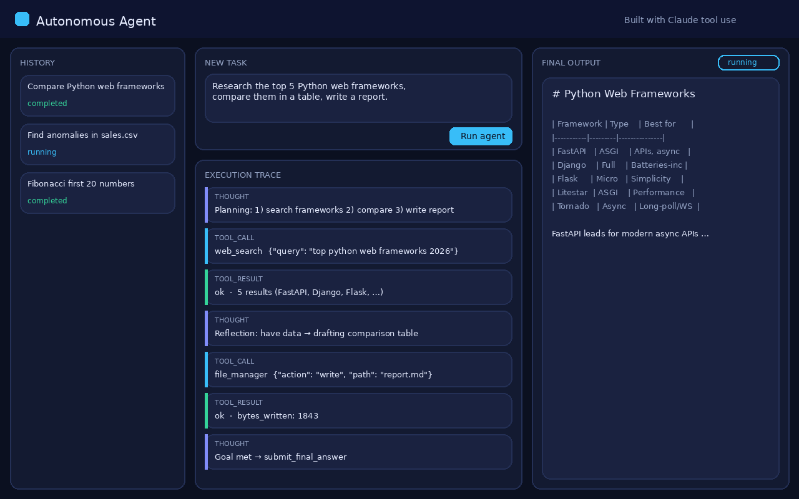

# Autonomous AI Agent

[](https://www.python.org/)
[](https://langchain-ai.github.io/langgraph/)
[](LICENSE)

A task-completion agent built on Claude tool use, orchestrated as a LangGraph state machine, served over FastAPI with Server-Sent Events, and driven from a React trace UI that shows every reasoning step as it happens.

Give it a goal in plain English. It plans, picks a tool, executes, observes the result, reflects, retries on failure, and streams the whole trace to the browser.



*The images in `docs/screenshots/` are generated UI mockups produced by `scripts/make_placeholders.py`, not captures of a live run.*

## The problem

An agent that returns only a final answer is impossible to debug — when it goes wrong you cannot tell whether the plan, the tool call, or the observation was at fault. This one is built trace-first: the reasoning loop emits a typed event at every transition, the API streams those events over SSE, and the UI renders them live. Anything destructive stops the loop and waits for a human.

## Quick start

### Docker

```bash
cp .env.example .env          # add ANTHROPIC_API_KEY
docker compose up --build
```

UI on http://localhost:5173, API on http://localhost:8000 (`/docs` for OpenAPI).

### Local

```bash
cp .env.example .env
./scripts/dev.sh              # venv + npm install + redis + both servers
```

Or run the backend alone with `python -m backend.run` (uvicorn on :8000 with reload).

### Driving it from the shell

```bash
TASK=$(curl -s localhost:8000/tasks -H 'content-type: application/json' \
  -d '{"prompt":"Compute the first 20 Fibonacci numbers in Python, run it, show output."}' \
  | python3 -c 'import sys,json;print(json.load(sys.stdin)["task_id"])')

curl -N localhost:8000/tasks/$TASK/stream      # live trace
curl localhost:8000/tasks/$TASK/result         # final answer
```

## How it works

```
PLAN ─▶ ACT (tool) ─▶ OBSERVE ─▶ REFLECT ─┐
  ▲                                        │
  └──────────── replan / retry ◀───────────┘
                    │
                    ▼
            submit_final_answer
```

`backend/agent/core.py` builds a LangGraph `StateGraph` with two nodes — `reason` and `act` — and a conditional edge out of `reason` that either dispatches a tool call, ends the run when the model calls `submit_final_answer`, or halts at `AGENT_MAX_ITERATIONS` (default 16). `act` always routes back to `reason`, so every tool result re-enters the model's context as an observation. Each transition emits an `AgentEvent`, which the API republishes as SSE.

**Memory.** Short-term memory is the in-conversation message log. Long-term memory is a ChromaDB persistent collection of past-task summaries; `recall_memory` searches it by similarity, and `MemoryStore` degrades to an in-process keyword search if ChromaDB is unavailable, so the agent still runs without the vector store.

**Human in the loop.** `send_email`, overwriting a non-empty file, and deletes emit `human_input_required` and block the graph until `POST /tasks/{id}/confirm` arrives. `AGENT_AUTO_CONFIRM=true` bypasses this for trusted runs.

### Tools

| Tool | What it does | Guardrails |
|---|---|---|
| `web_search` | DuckDuckGo top-N results | — |
| `http_request` | Arbitrary method, truncated response body | http(s) schemes only |
| `code_executor` | Python in an isolated subprocess | 30s default wall clock (60s max), 512 MB `RLIMIT_AS`, 25s `RLIMIT_CPU`, `python3 -I`, scrubbed env, CWD pinned to the task workspace |
| `file_manager` | read / write / append / list / delete | workspace-scoped, path traversal rejected; overwrite and delete need confirmation |
| `send_email` | SMTP via aiosmtplib | always needs confirmation; dry-runs when SMTP is unset |
| `recall_memory` | Semantic search over past task summaries | — |
| `submit_final_answer` | Terminates the graph with the structured answer | — |

## API

| Method | Route | Purpose |
|---|---|---|
| `POST` | `/tasks` | Submit a task, returns `{ task_id, stream_url }` |
| `GET` | `/tasks/{id}/stream` | SSE stream of reasoning, tool calls, and results |
| `GET` | `/tasks/{id}/events` | Buffered event list (non-streaming) |
| `GET` | `/tasks/{id}/result` | Final answer + artifacts |
| `GET` | `/tasks/{id}` | Task metadata + state |
| `GET` | `/tasks` | Recent task history |
| `POST` | `/tasks/{id}/confirm` | Approve or reject a pending destructive action |
| `GET` | `/tools` | Available tool schemas |
| `GET` | `/healthz` | Liveness + config flags |

Every SSE event is `{ kind, payload, ts }`, where `kind` is one of `task_started`, `iteration`, `thought`, `tool_call`, `tool_result`, `human_input_required`, `task_completed`, `task_failed`.

## Tech stack

**Backend** — Python, FastAPI, sse-starlette, Pydantic v2 + pydantic-settings, `anthropic`, LangGraph + langchain-core, ChromaDB, Redis (with in-memory fallback), duckduckgo-search, httpx, aiosmtplib.
**Frontend** — React, Vite, TypeScript.
**Ops** — Docker Compose, nginx for the built frontend.

## Configuration

| Variable | Default | Notes |
|---|---|---|
| `ANTHROPIC_API_KEY` | empty | Required |
| `AGENT_MODEL` | `claude-sonnet-4-6` | |
| `AGENT_MAX_ITERATIONS` | `16` | Loop safeguard |
| `AGENT_AUTO_CONFIRM` | `false` | Skip human-in-the-loop gates |
| `REDIS_URL` | `redis://localhost:6379/0` | Falls back to in-memory |
| `CHROMA_DIR` | `./data/chroma` | Long-term memory |
| `WORKSPACE_ROOT` | `./data/workspaces` | Per-task sandbox directory |
| `CORS_ORIGINS` | `*` | |
| `SMTP_*` | empty | Blank means email dry-runs |

## Tests

```bash
cd backend && pip install -r requirements.txt pytest && pytest -q
```

Seven tests covering tool dispatch, path-traversal rejection, sandbox timeout behaviour, and the memory store's keyword fallback. No live API calls required.

## Status and limitations

- **`code_executor` is not a real sandbox.** It applies `RLIMIT_AS`/`RLIMIT_CPU`, runs `python3 -I` with a scrubbed environment and the CWD pinned to the task workspace, and evicts `socket`, `urllib.request`, and `http.client` from `sys.modules` — but a script can simply re-import them, so that last measure is a speed bump, not a boundary. For untrusted input, run the whole backend inside a container sandbox (gVisor, Firecracker) rather than relying on this.
- **The screenshots are mockups**, generated by `scripts/make_placeholders.py`. Replace them with real captures after a run.
- The test suite is small (7 tests) and does not exercise the LangGraph loop end to end — that path is validated by running it against the live API.
- Task state lives in Redis or in process memory; there is no durable database, so history is lost on a full restart without Redis.
- Requires an Anthropic API key. There is no offline or mock mode.

## License

MIT — see [LICENSE](LICENSE).
